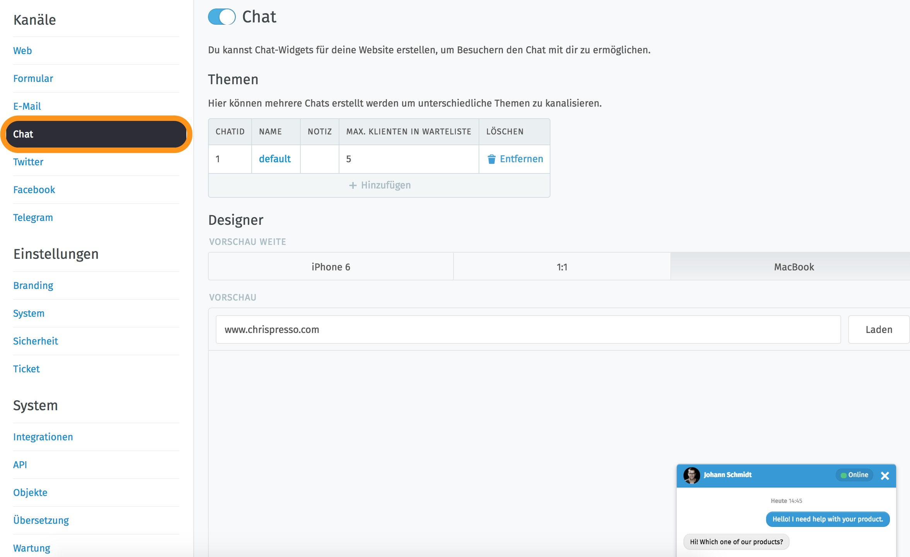

Chat
****

You can create chat widgets for your web pages to allow visitors to chat with you.

The area for configuring the chat can be found in the admin area at Channels --> Chat:

You can set up chats for different websites and edit them independently. The integrated designer helps the chat-widget to adapt to the website color. If the proposed design does not like, this can be adjusted manually. Through the different previews you have the possibility to display directly how the presentation looks at different devices.

**Usage**

Insert the widget code into the source code of every page the chat shall be visible on. It should be placed at the end of the page's source code before the </body> closing tag.

**Requirements**

Zammad Chat requires jQuery. If you don't already use it on your website include it like this:

You have two options to implement the chat on your website:

- Automatically show chat (that's the default-setting)
- or manually open chat.

In the adminarea you can also find more information about the customization of the chat.
