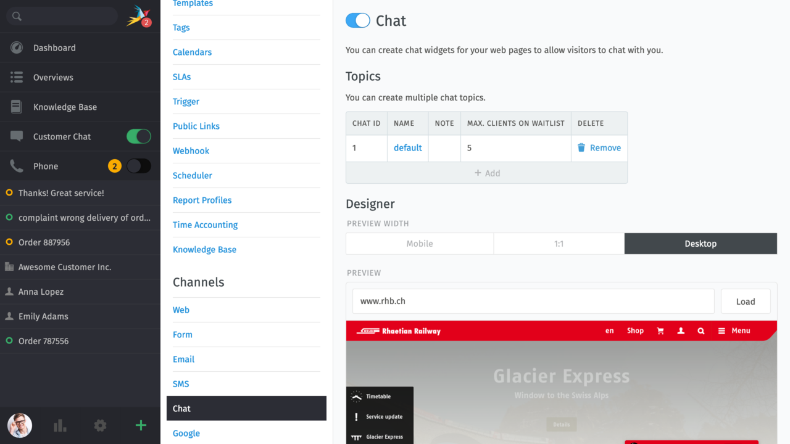
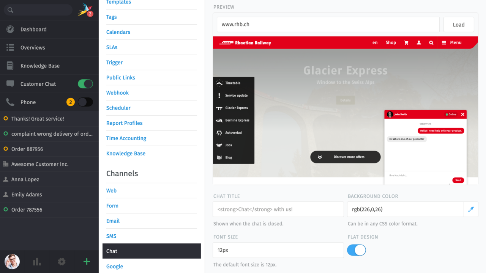
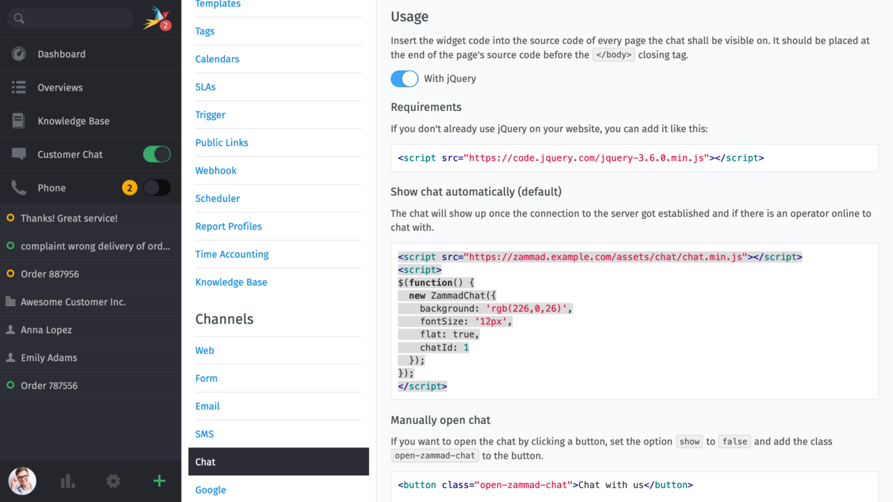
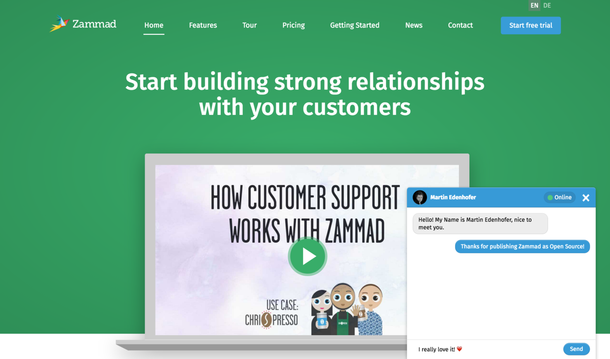

Chat
****

Chat has gotten very important for company and overall customer support. If used properly, support via Chat
can be a real efficiency booster. A downside of Chats is when nobody responds or a Bot responding to the customer. 

How to improve Support by Chat?
===============================

We've asked others about their opinion in our circles, to learn what people expect or dislike.
This is what we found out:

**Good experiences**

* Getting personal support by a human being
* Getting a fast response
* Solving my problem quickly

**Bad experiences**

* A chat window on a website (while the Chat being offline) with the hint to "Leave a message"
* Long waiting queues before even writing with a personal
* Receiving a message like "My name is Nina, what can I do for you?" after sending a message with my issue.
* A Chat that doesn't integrate itself into the Website properly

Our answer: The Zammad Chat Widget
==================================

The task is clear: Get the disadvantages and improve them. Our approach is as follows:

* We'll only display the Chat widget, if at least one agent is available and the agent still has capacity.
  - If no agent is online or the agents are absend, the chat won't be available
* We're setting an agent as inactive, if the agent doesn't accept new chat requests or the WebApp is offline.
  This way, your support staff can take breaks without your customers waiting ages for a reaction (see above point)
* Zammad does not respond to chat messages on it's on to ensure that there's no strange delay coming 
  afterwards. Zammad will fire a (configurable by agent) auto response as soon as the agents accepts the Chat
  request.
* Zammad will tries to adapt your main website colors to the chat. You can also adjust those colors allowing
  you to integrate the Chat into your website, as it would have always been there.
  
  
Configuration of the Chat widget
================================

You can create chat widgets for your web pages to allow visitors to chat with you.

The area for configuring the chat can be found in the admin area at Channels --> Chat:

You can set up chats for different websites and edit them independently. The integrated designer helps the chat-widget to adapt to the website color. If the proposed design does not like, this can be adjusted manually. Through the different previews you have the possibility to display directly how the presentation looks at different devices.

**Usage**

Insert the widget code into the source code of every page the chat shall be visible on. It should be placed at the end of the page's source code before the </body> closing tag.

**Result**

The final result will look like the following:

**Requirements**

Zammad Chat requires jQuery. If you don't already use it on your website include it like this:

You have two options to implement the chat on your website:

- Automatically show chat (that's the default-setting)
- or manually open chat.

**Chat restrictions**

You offer a chat for your target group, but you don't want to activate chat for certain IP areas or countries? Then you have the possibility to store this fast and easily per chat configuration in the admin area. You can define for which areas no chat should be offered:

.. image:: images/channels/channel-chat-3.jpg

In the adminarea you can also find more information about the customization of the chat.
