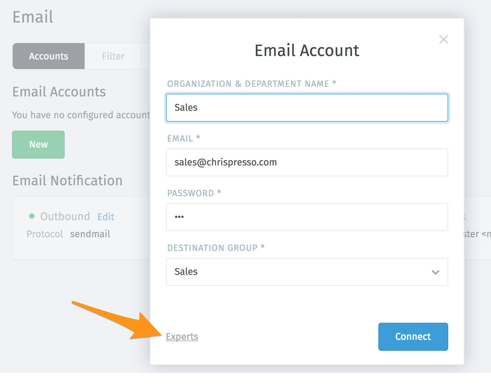
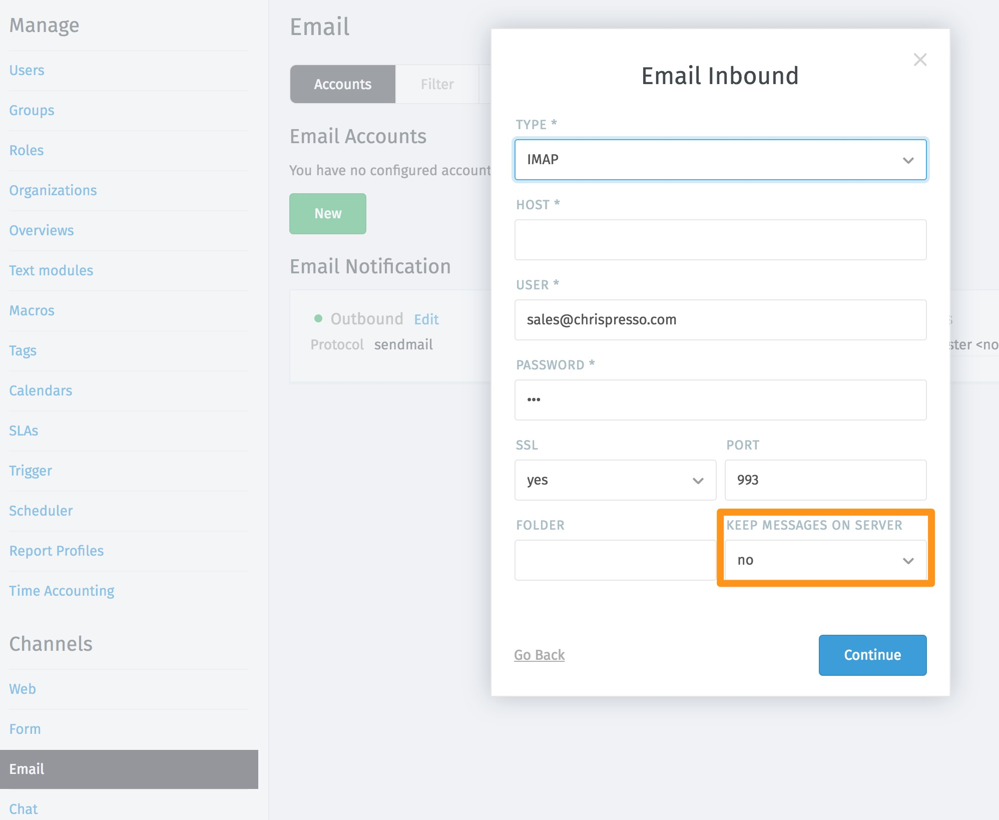
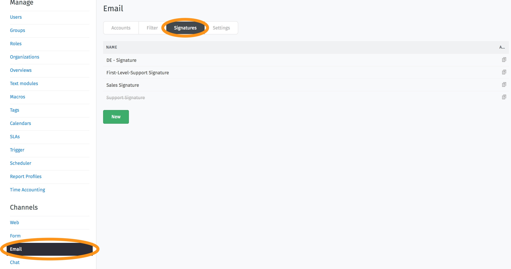
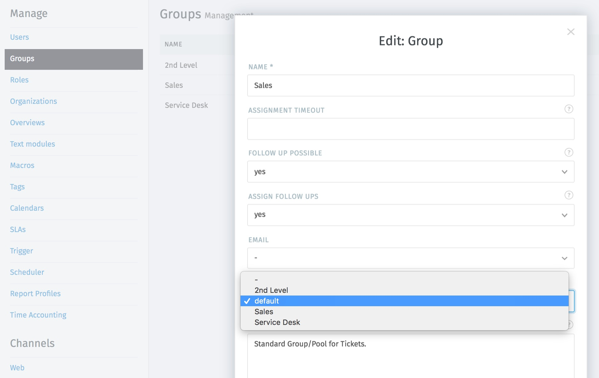
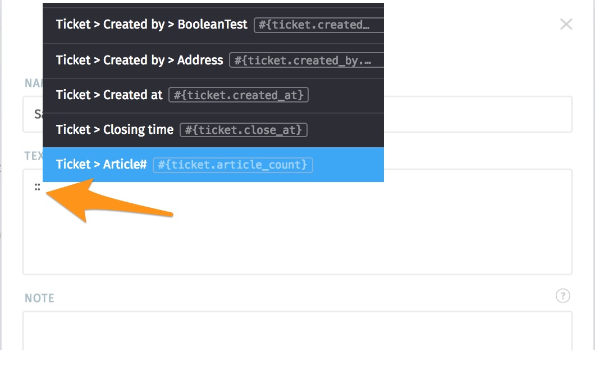
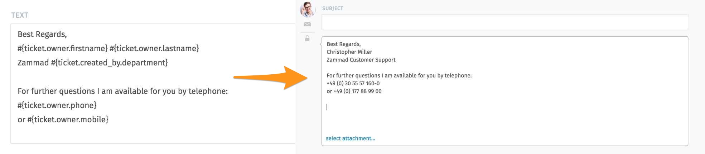
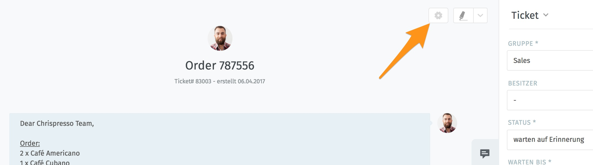

E-Mail
******

Accounts
----------
All system email addresses can be added in this menu item.
If you want to fetch emails via POP3 or IMAP you have to create a mail channel in here.

.. hint:: If you're using Office365- or Exchange-Mailboxes, please ensure that your Mailbox is not shared, but a normal mailbox account.

Just follow these steps:

- Click “New”
- Enter “Organization & Department Name”
- Enter “Email address”
- Enter “Password”
- Enter “Destination Group”

Zammad tries to detect the POP3, IMAP and SMTP server settings automatically. This should work most of the time. If it doesn’t, use the “Experts” button to configure it by yourself.

While creating a new e-mail account, it is possible to use the expert settings to determine whether the e-mails remain in the connected mailbox or whether they should be transferred completely into the Zammad in order to avoid duplicate processing of e-mails:

1. step:

2. step:

.. Note:: As soon as the email account is integrated and emails are imported, any notifications set via the trigger will be sent. It is therefore essential to check in advance that triggers with automatically generated messages are deactivated.

Filters
-------
Postmaster filters allow you to match email headers (e.g. ``From``, ``To``, ``Subject``, ``X-Spam-Flag`` etc.) and execute a set of actions whenever Zammad's email parser encounters a matching email. The actions will be applied to the ticket that is created or updated by this email. Here are some examples of what is possible with filters:

- Automatically dispatch tickets into certain groups:

  For example, tickets from ``amazon.com`` could automatically be dispatched to the Purchasing group.
  
  | From: contains: ``regex:(\.|@)amazon\.com``
  | Group: Purchasing
  
  .. Note:: Note that the Group action only has an effect when the matching email results in a new ticket. Zammad will not change the group of existing tickets.
  
- Automatically increase the priority of tickets from a VIP customer:

  | From: contains: ``ourvipcustomer@example.com``
  | Priority: 3 high

  .. Note:: Note that the Priority action only has an effect when the matching email results in a new ticket. Zammad will not change the priority of existing tickets.

- Automatically tag and close spam tickets that have been marked as spam by an external spam filter (e.g. SpamAssassin):

  | X-Spam-Flag: contains: ``YES``
  | Tag: add: ``spam``
  | State: closed
  
  .. Note:: Note that the State action only has an effect when the matching email results in a new ticket. Zammad will not change the state of existing tickets. It will add the tag though if it missing, even if the mail is an update to an existing ticket.

The following actions are only effective when creating tickets: Group, State, Priority, Owner.

Different attributes of a filter can be combined with each other. Likewise, the following actions can be combined. The supported matches are "contains" and "contains not"; for advanced matching, you can use regular expressions by prefixing the string with ``regex:``.

Note that Zammad matches against the full header, e.g. for a mail with "``From: Display Name <display.name@example.com>``", the ``From`` condition will test against "``Display Name <display.name@example.com>``". This is especially important when using anchored regular expressions; ``regex:^display\.name@example.com$`` would not match this mail!

It should be borne in mind that the combined attributes build on each other. If a filter is no longer needed, it can either be temporarily set inactive or deleted directly.

Signature
---------
You can create a separate signature for each group in Zammad. The individual signatures can be created and edited here:

Afterwards, the existing (and active) signatures are available in the group editing mask:

Each group can be assigned its own signature, but they can also all use the same signature. 

To individualize the signatures, it is possible to automatically loaded specific information into a signature via "Snippets". All information stored on the ticket, assigned customers or agents can be inserted. This makes it possible to design the signature individually. To load a list of possible snippets, press"::" (two colons) in the text field of the signature:

Here is an example of a signature-setting and and how it might actually look like:

Currently the snippets can only be loaded into already created tickets (status Zammad 2.5)

Additional E-Mail Setting
-------------------------

Since version Zammad 2.0 there are different ticket settings that can be made directly on the ticket. These settings are at the top of each ticket, to the right of the subject:

The following options can be set individually by each admin:

Note
     Default visibility: Is a note created in the standard system as internal or external? (this setting can be changed later on for each article)

E-mail subject
     If this setting is deactivated, the e-mail subject is regenerated based on the ticket subject. If you enter "yes", you can enter a separate subject for each article.

Email - full quote
     If this setting is activated, the content of all previous articles marked as external will be listed at the end of the new message.

Twitter initials
     Adding the sender's initials to the end of a tweet.

Advanced E-Mail-Configuration
-----------------------------

The following options need console access to your Server that hosts Zammad.

.. toctree::
   :maxdepth: 1

   channel-email/fetchmail
   channel-email/sendmail
