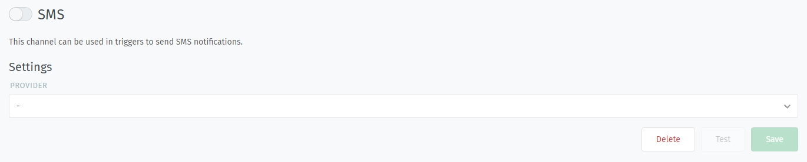
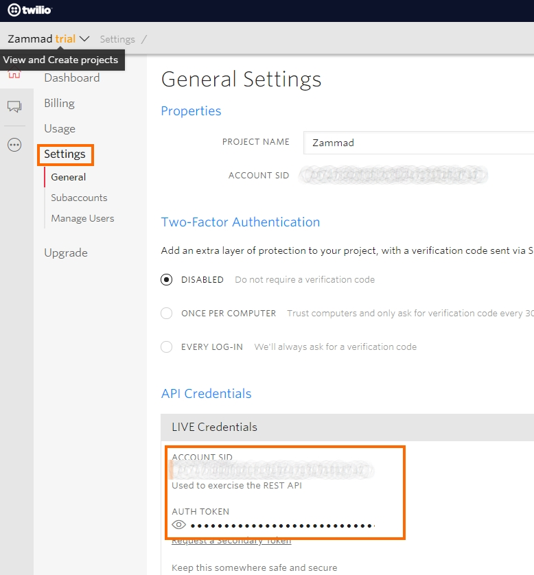
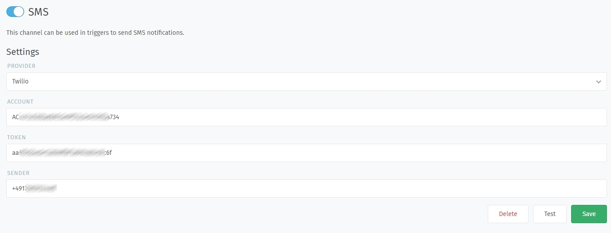
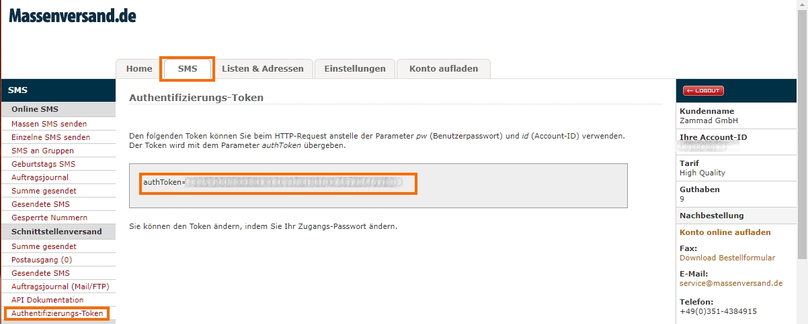
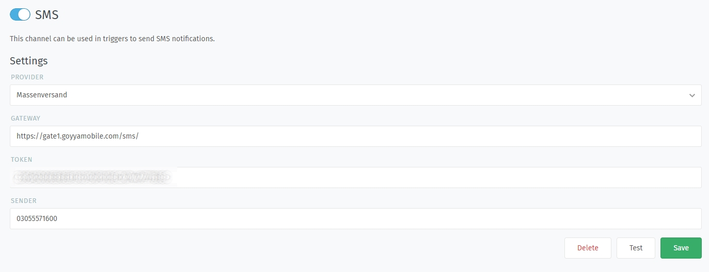

SMS
****

The SMS Channel allows you to send SMS via Trigger or an Automation. This can be useful if you need to send a notification to a customer or an Agent in important situation.
Zammad currently supports two SMS-Providers: Massenversand (DE) and Twiliio (international).

**Please note:** Depending on the used service, there might be requirements for legal stuff and also, the phone numbers have to be formatted correctly!

Twilio (international)
----------------------

This configuration guide assumes that you already have an account and project set up!

Log in to your Twilio account and go to the settings of your project. You'll need to authenticate yourself, as you need access to the API-Token.
Under "LIVE Credentials" you can find the Account SID (Account field in Zammad) and the Auth Token used for authentication within Zammad. 
The sender has to be a SMS capable number - otherwise you won't be able to send E-Mails.

You should be ready to go. Save the settings and enable the SMS Channel. YOu can also use the test button to send a test message to your mobile phone.
If something goes wrong at this point, Zammad will let you know and give you the error message of the API.

Massenversand (DE)
------------------

This configuration guide assumes that you already have an account set up! Massenversand is a German provider, the interface is only available in German.

Log in to your massenversand account, change to "SMS" and head over to "Authentifizierungs-Token". On the next page you can get the Auth-Token you'll need for Zammad (Token).
You then need to specify the Sender, which can be 11 alphanumerical or 16 numerical URL-Encoded signs. If you want your customer do answer to this SMS, ensure to set a proper phone number.
In order to be able to send the SMS, you also need to specify the Gateway. Please refer the documentation of massenversand.de, as we cannot cover problems on that level. https://pro.massenversand.de/daten/Interface_SMS_Versand.pdf

If you're ready to go, press save. You then can activate the SMS Channel. You can also use the test button to send a test message to your mobile phone.
If something goes wrong at this point, Zammad will let you know and give you the error message of the API.

Possible gateways:
::
 GW1: https://gate1.goyyamobile.com/sms/sendsms.asp		(Load-Balanced)
 GW2: https://gate2.goyyamobile.com/sms/sendsms.asp		(without Load-Balancing)

Testing sending a SMS
---------------------

By using the test button, you can open a new dialog asking you for a phone number and the test message. 
With this, you can verify that your setup is working like it should be. Normally the reaction of the API will be very fast.

If you're heading into error messages from the API, please contact the support of the SMS provider, as this will most likely a configuration problem.
Please note that we are not able to help you on configuration mistakes.

--Screenshots HERE--