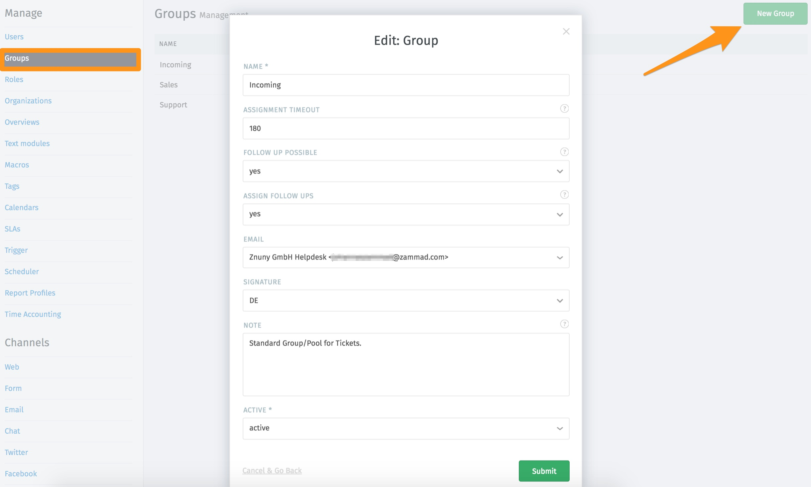

Groups
******

This is the group-manage area. You can edit existing and add new groups.

What are groups actually?
  Groups in Zammad are similar to working groups that deal with different topics within a company.
  For example, The tickets relevant to the sales department are available in the 'Sales' group, while the tickets for the support department are available in the 'Support' group.
  Tickets enter Zammad through various channels and are sorted by groups. The tickets (cases) are thus made available to the agents responsible for the group.
  A group can be compared to a cabinet in which the folders (with cases that need to be processed) are set sorted.
  Each agent has his / her closet for which he is responsible.
  Several people can be responsible for processing the cases inside the cabinets and work on them. This setting can be defined for each individual user in Users Management

**group-settings**

By clicking on a group or clicking "new group" you access the edit mask. The following settings can be made here:

- set or change the name
- Assignment timeout (in minutes) --> The time after the ticket is changed to "unassigned" after the assigned agent does not work on the ticket
- follow-up possible --> This is about the decision, what happens with a new message from the customer after a ticket has been closed. Either the status of the ticket is changed to "open" (yes) or a completely new ticket is created (no)
- assign follow ups --> Here it is to decide whether in the case of a follow up the agent is to be registered as the owner who was saved as the last owner (yes) or whether the owner should be left open (no)
- E-Mail --> the Email-address the group is assigned to. That means that all tickets sent to this e-mail address will be assigned to this group. Also, this email address is the sender address for e-mails written from the system.
- signature -->  an already created signature can be selected (Channels --> E-Mail --> Signatures)
- note --> notes are visible to agents but never to customers
- set the group active or inactive

Eventually it should look something like this:

The access rights for agents to a group can be set up as follows:

1.) directly via the user administration (Admin-Interface --> Manage --> Users), please see: :ref:`manage_user_rights`

or

2) With the permission setting via a role (Admin-Interface --> Manage --> Role), please see: :ref:`manage_roles`

It is recommended to avoid using both configurations.

.. Hint:: If the "Group" field does not appear in the ticket information, check whether:

    * more than one group is created
    * the current user has change-permissions to more than one group

  This is because Zammad automatically hides selection fields with only one selection
