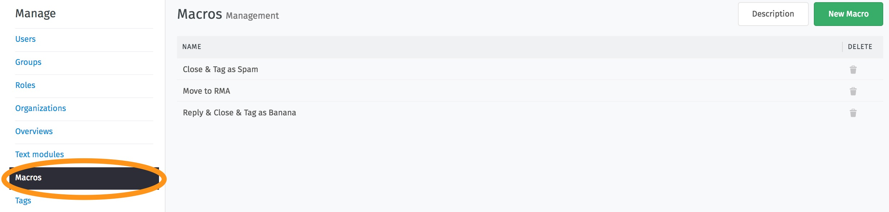
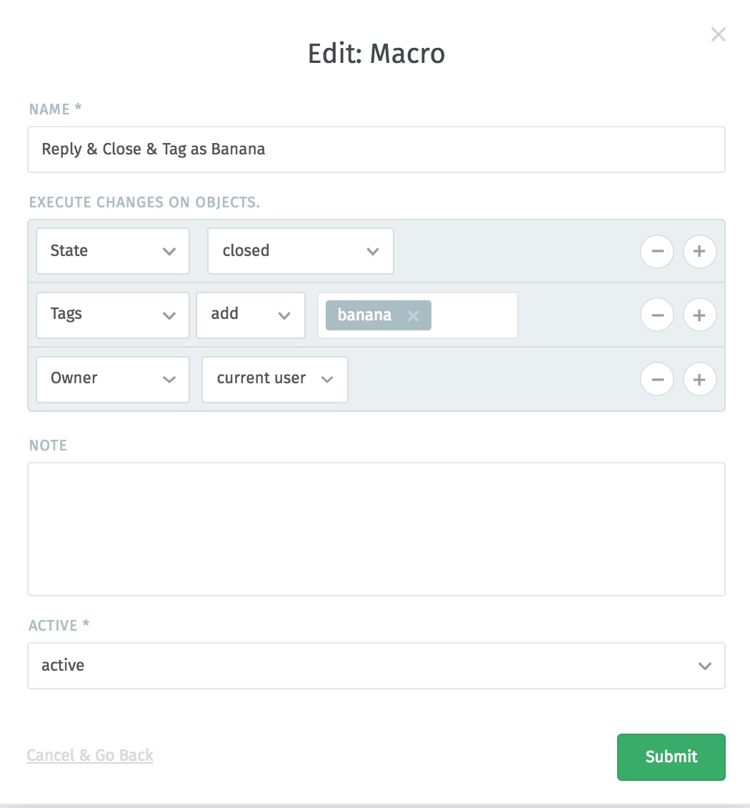
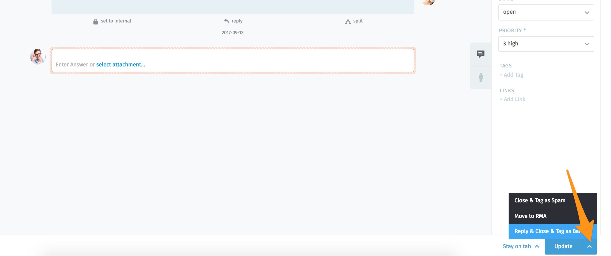
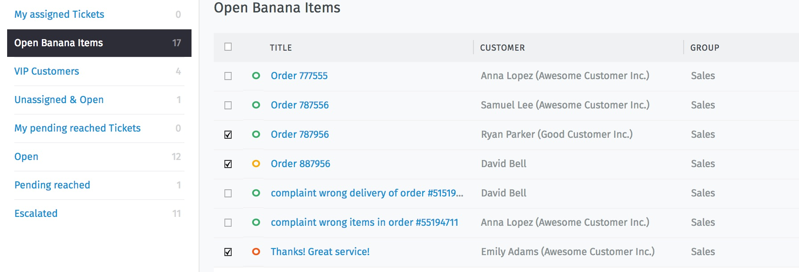
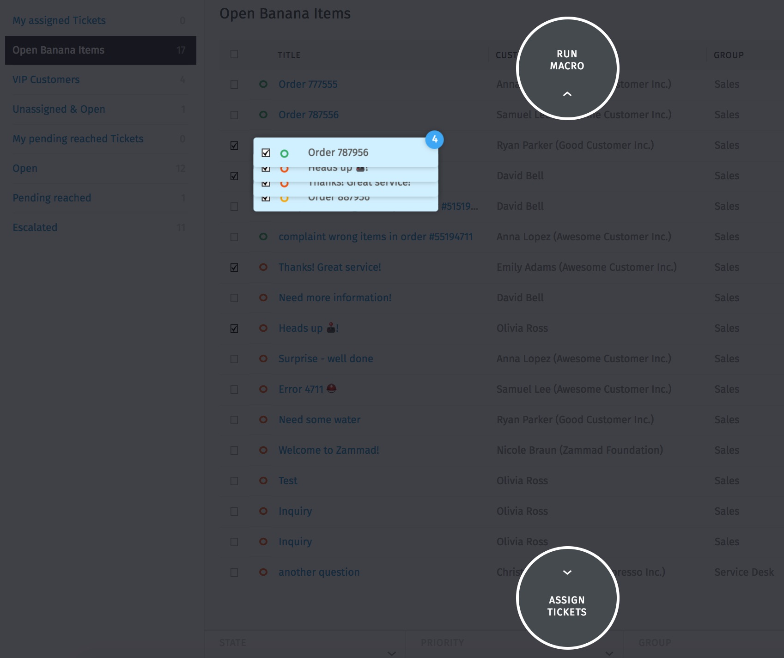
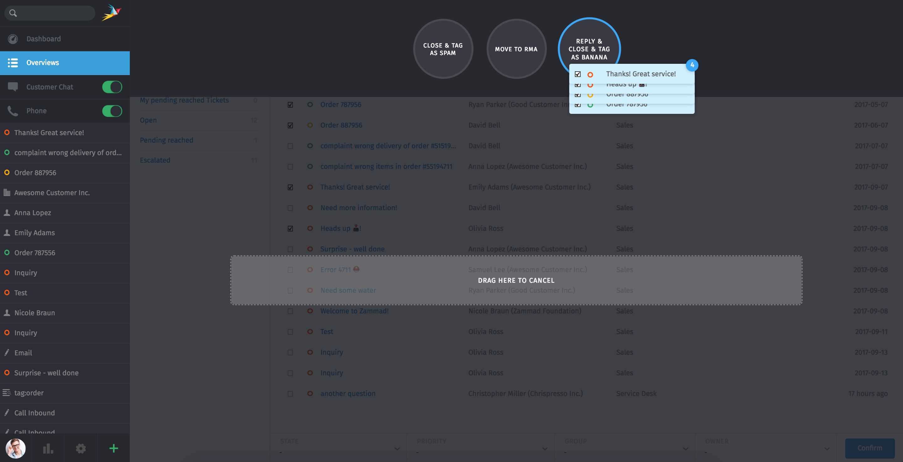

Macros
******

You can use macros in Zammad to automate recurring sequences, saving time (and nerves). This allows a combined sequence of actions on the ticket to be executed with just one click.

In the Macros Management Mask you can add, edit and delete macros.

That's how the edit-mask look like:

One macro can contain any number of changes to the ticket. In this example you close the ticket, set the owner and tag the ticket - all with just one click!

**Is a macro created, it can be applied via two paths:**

1. In the ticket on the right lower corner. There is an arrow next to the "update" button. All active macros are displayed here:

2. If you want to apply a macro for more then one ticket, you have to select all the corresponding tickets in the overview:

click on them and move the mouse pointer:

Now all macros are displayed and you can move all the tickets into it:

