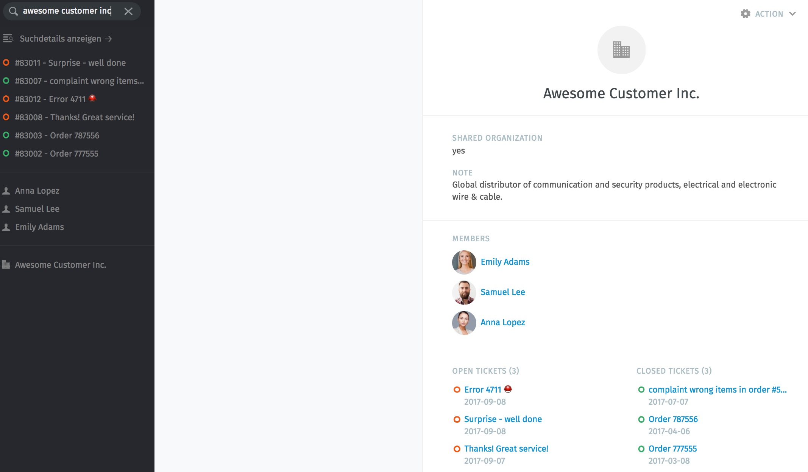
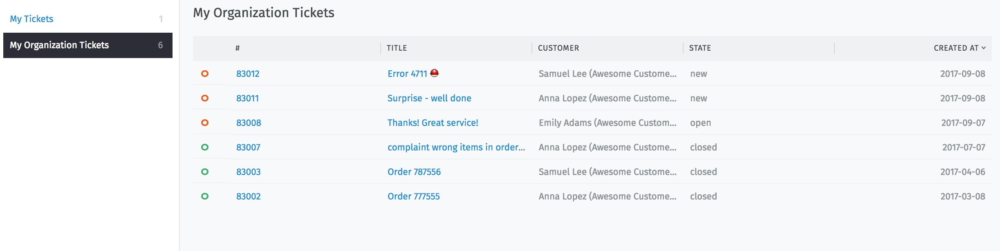
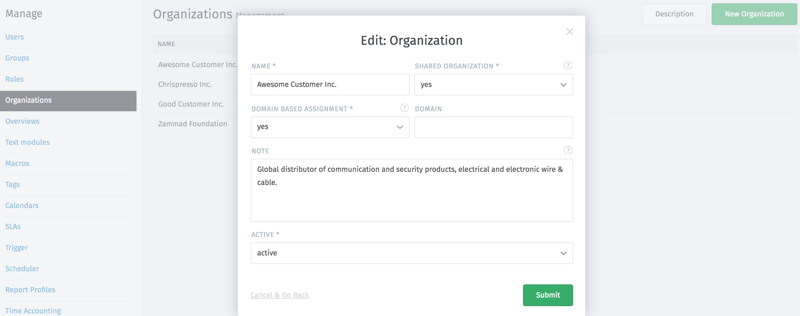

Organizations
*************

Organizations allow you to group customers. This has two important advantages, among other things.

1.) As an agent you have not only the overview of a customer's tickets, but also an overview of the entire organization.

For example, by searching for the organization, all the tickets are displayed and they can be opened easily by click.
This overview appears as follows:

2.) As a customer, you can view and edit your colleagues' tickets (if the organization is a "shared organization", you can set this as the parameter for each organization. See the Edit-Mask).

**For example:**
   A customer user who has only created one ticket himself, but whose entire organization is 6, the overview looks like this:

In the organizations management area (Admin Interface --> Manage --> Organizations) you can manually add, edit or delete existing organizations. That's the Edit-Mask:

Within the organization can be set the following things:

- if it's a shared organization (All customers who are assigned to this organization can view and edit the group tickets)
- if the assignment is domain based (assign users based on domain)
- note
- if it's active or inactive
