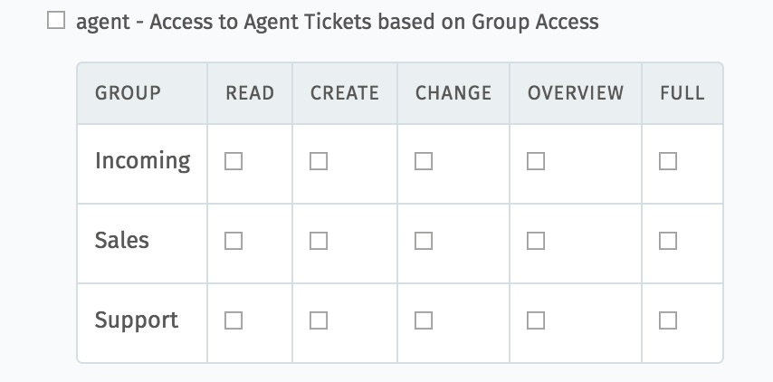
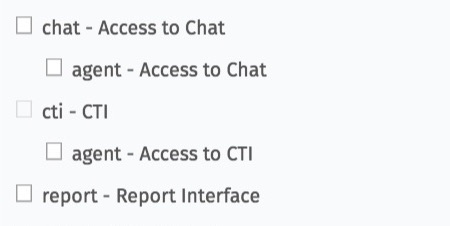
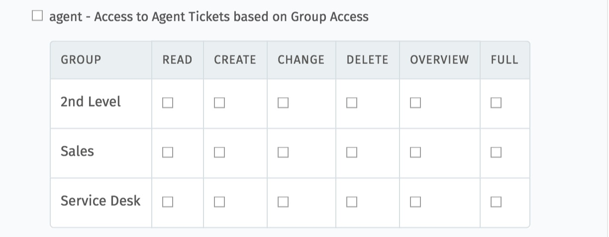
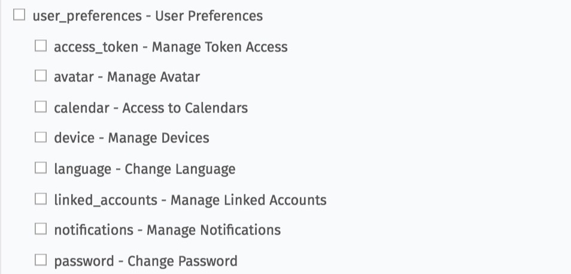
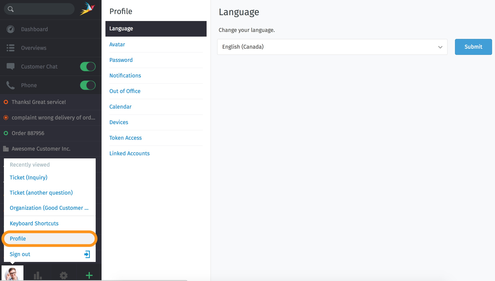
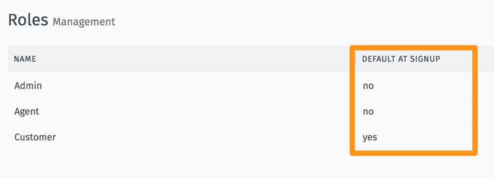

Roles
*******

... are the aggregation of groups. These should represent the field of activity / functional description of the agent. A user can be active in several roles.

The assignment of rights directly via a group should be avoided when roles are used.

Admin
-------

An admin role can be given access to different areas in the admin interface. You can give someone full access to the admin area (Admin - Admin Interface = yes). However, it is also possible to distribute only access to some areas.
For example, you could choose someone as a "Text-Module-Coordinator" who is a normal agent, but coordinates all changes in this area. In this way the admin can be relieved.

You can give access to the following sections:

**Understanding each Permission:**

**READ**
     Read only access to the tickets and entries of this group.

**CREATE**
     Right to create tickets or entries in this group.

**CHANGE**
     Right to change the attributes of tickets or entries or areas that belong to this group.

**OVERVIEW**
     Right to see tickets in the overviews. A view of the ticket details is not possible

**FULL**
     Right to create, read, change and see tickets in the overviews.

Agent
-------

The authorization can be assigned to the individual communication functions:

In addition, access rights can be given to the individual groups:

Customer
-------
Access to customer tickets based on current_user an organization
--> This checkbox gives the user access to his or her own tickets created in the ticket system. If the customer is a member of a "Shared Organization", he can also see those of the organization.

User preferences
-------

For each of both, agents and customers, you can define which areas are available in the user preferences:

These settings refer to the personal settings that can be set here:

hint
  If agents are not allowed to change their own passwords, no check mark must be set at "Password". In this case, only the admin can assign and change a password.

Default at signup
-------

One of the roles should be created as the "default role" (default at signup = yes). When someone registers in the system who has not yet been registered in the systems, this role is given to them.
This is usually the role "Customer". All other roles must be set to "no".

To keep an overall view of this, the field selection (yes/no) is displayed in a column in the role overview:

