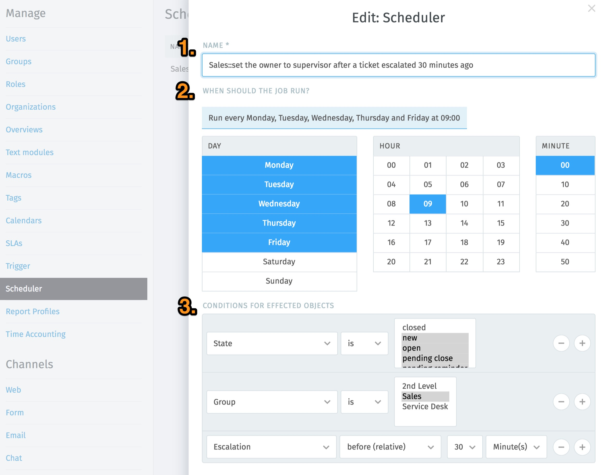
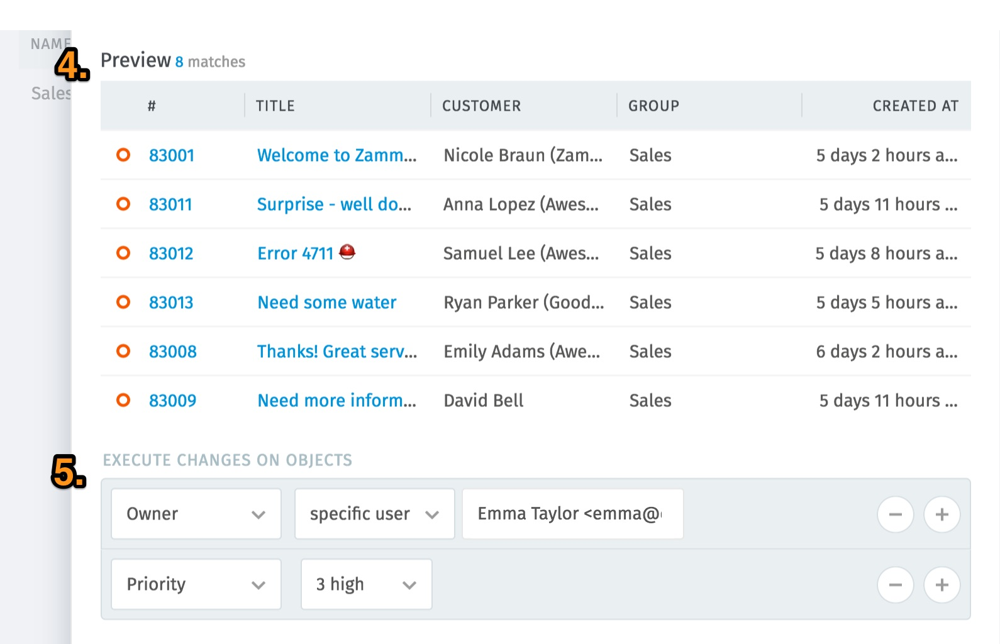
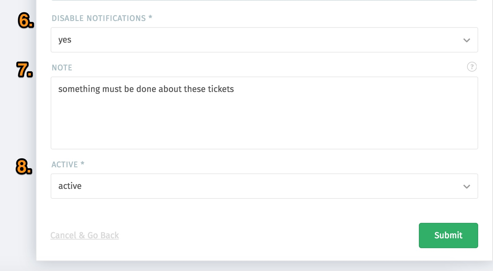

Scheduler
*********

The sheduler performs time-based automated actions. Such an action may be a change of any information on the tickets.

That's how it works:

1. Set the name
2. Set the time when the job should run
3. Determine the ticket attributes (conditions) to limit the tickets on which an action is to be performed
4. Preview of the selected tickets - here you can doublecheck the entered conditions 
5. Determine the change to be made on the ticket. It is advisable to make a note on the ticket when carrying out the action. This ensures that this step is visible to all users in the ticket.
6. Should notifications be issued or not? (yes -> no notifications are sent / no -> notifications are sent)
7. Insert a note to the ticket so that everyone can see what has happened in the ticket (only agents can read the note)
8. Set the scheduler to inactive

For this example, it means:

Every day (Monday to Friday) at 9:00 a. m., all tickets will be:
- assigned to the Sales group and 
- are not closed 
- and whose escalation was 30 minutes ago

assigned to Emma and the priority is set to 3-high.

As a supervisor in the Sales group, this enables you to intercept and process escalated tickets.

BTW: this is the only place where it's possible to delete tickets via frontend (action --> delete)