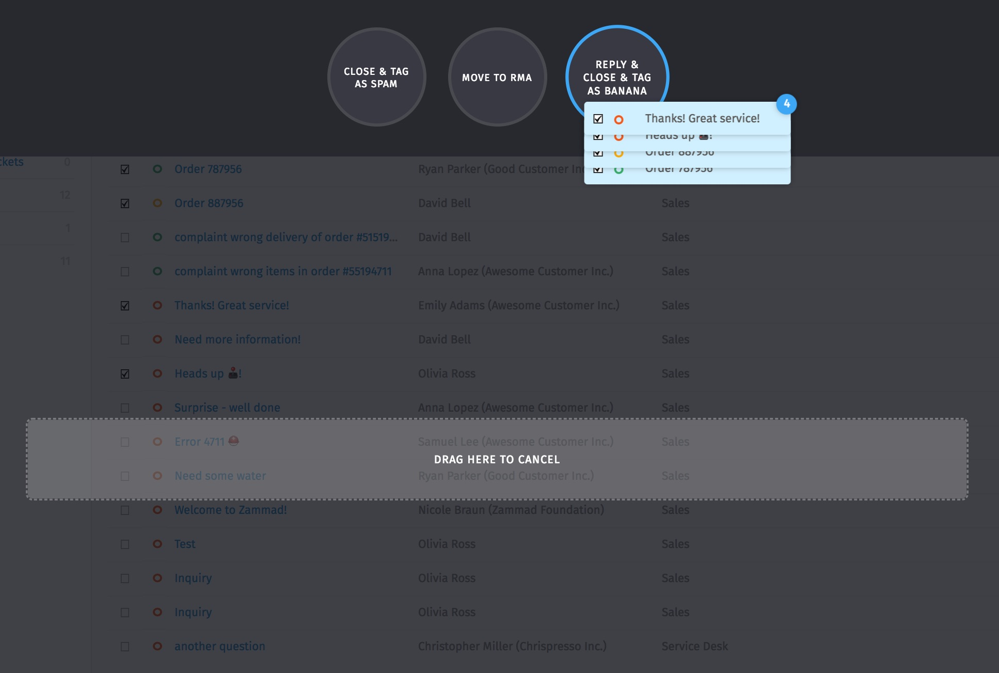
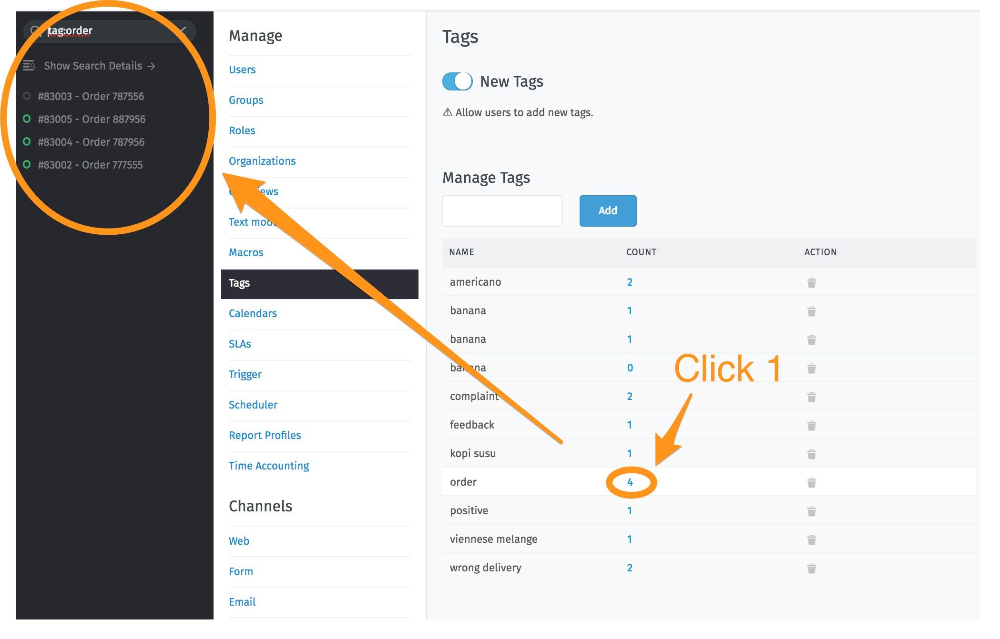
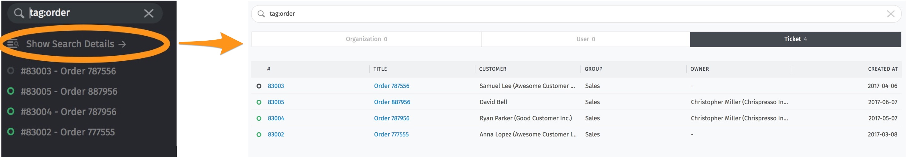

Tags
****

With tags, tickets can be categorized and marked.

How to tag
--------------
All agents can tag tickets. Therefore you will find further information here:

`<http://zammad-user-documentation.readthedocs.io/de/latest/zammad-ticket-tags.html`_

Tag-Overviews
--------------

You can list all the marked tickets by tag in different ways:

**1. by providing an appropriate overview**
  Create a new overview and select "Tag contains ..." as condition.
  More information about overviews can be found here: `<http://zammad-admin-documentation.readthedocs.io/en/latest/manage-overviews.html>`_

**2. by a search-query**

Enter e. g.: "tag: banana" in the search mask and you will receive all tickets that have been tagged accordingly. For a collected listing, click on "Show Search Details" under the search box:

**3. by clicking on the tag in the Tag Management Area**

In the Tag Management you can find an overview of existing tags used in the system (and a counter how often they are used):

.. image:: images/manage/tag_banana2.jpg

For more information about the individual tags, just click on the blue counter:

Select one of the tickets that appears below the search box or get a complete overview of all tickets by clicking on "Show Search Details":

Tag Management Area
--------------

Here it can also (in addition to the overview - as described above) be set whether the agents are allowed to add tags themselves or not (in the left upper corner).

You can add more tags or delete them.
