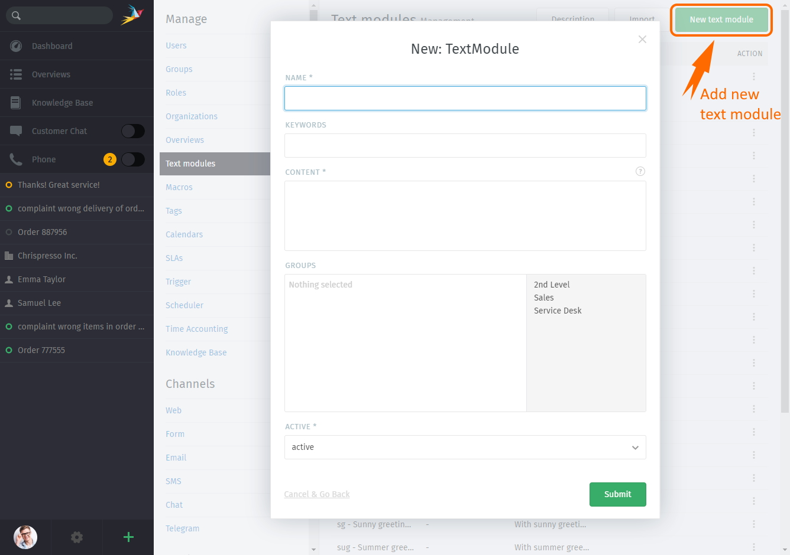
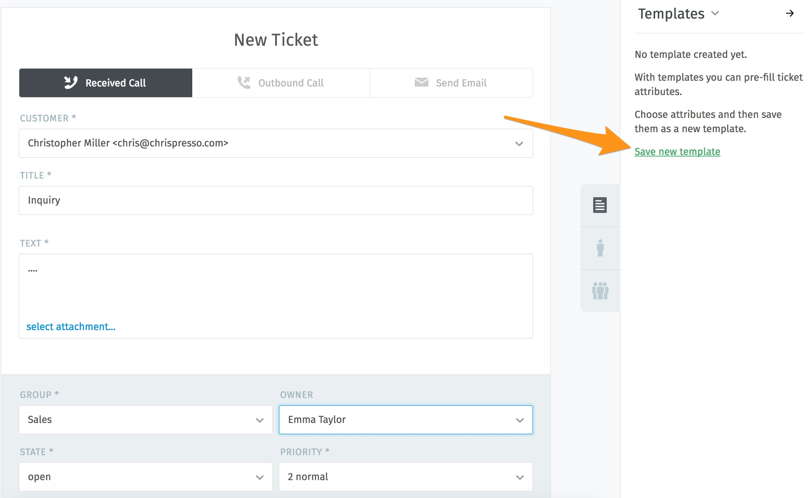
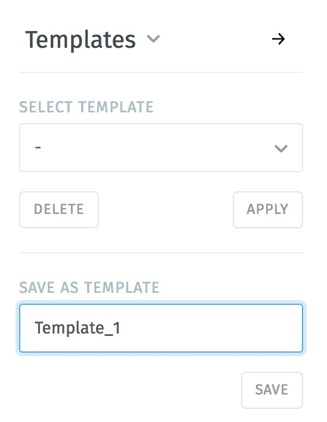

Text Templates
************

Create text templates to spend less time writing responses. You can create text passages (Text modules) or even entire response templates.

Text modules
----------

Text modules can be edited in the admin interface under Manage --> Text modules.
Here you will find text snippets already created in the standard version, which can be extended as needed.

Creating keywords makes it easier to find the right text module.

To select placeholders from a list, just enter "::" in the text block. The list can be searched with the arrow keys after inputting keywords or shortcuts.
All text modules can be used in articles as well as in triggers (auto-messages) and in chat.

**Tip:**
If text modules are to be grouped, this can be done using shortcuts. Example country codes:

Text modules are created for the group Germany as follows:
Ger_Textmodule1
Ger_Textmodule2
...

for Austrian-Snippets:
Aut_Textmodule1
Aut_Textmodule2

only the relevant text modules are displayed for each country

Text modules can include smart variables like the users name or email address.
Here you can add new text modules, delete or edit them.

Examples of snippets are:

Hello Mrs. #{ticket.customer.lastname},

Hello Mr. #{ticket.customer.lastname},

Hello #{ticket.customer.firstname},

My Name is #{user.firstname},

Of course you can also use multi line snippets.

Available objects are:

ticket (e. g. ticket.state, ticket.group)

ticket.customer (e. g. ticket.customer.firstname, ticket.customer.lastname)

ticket.owner (e. g. ticket.owner.firstname, ticket.owner.lastname)

ticket.organization (e. g. ticket.organization.name)

user (e. g. user.firstname, user.email)

Email-Templates
----------
If entire tickets with similar content are often created, ticket templates can be created. This speeds up ticket creation. Ticket templates can contain the following information: ticket type, customer, title, test, group, owner, status, priority and tags.
The templates can be accessed via the letter icon as shown in the following picture:

Here you can either select an already created template or save the current one under a desired name.
When you create a new template, all the required information is entered in the ticket and an appropriate name is selected, which is entered in the field "Save as template". After clicking on "Save", the template can be selected during the future ticketing process.

The templates are available for all agents.
