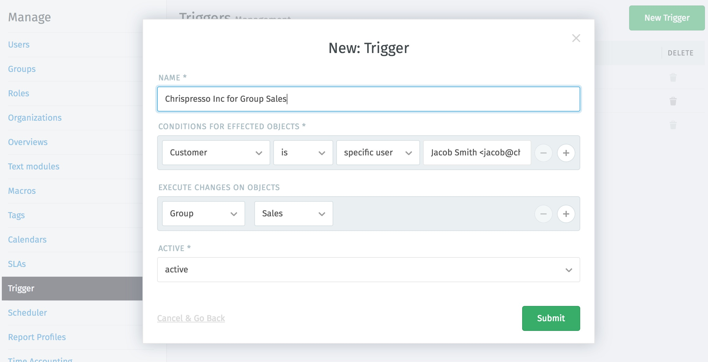
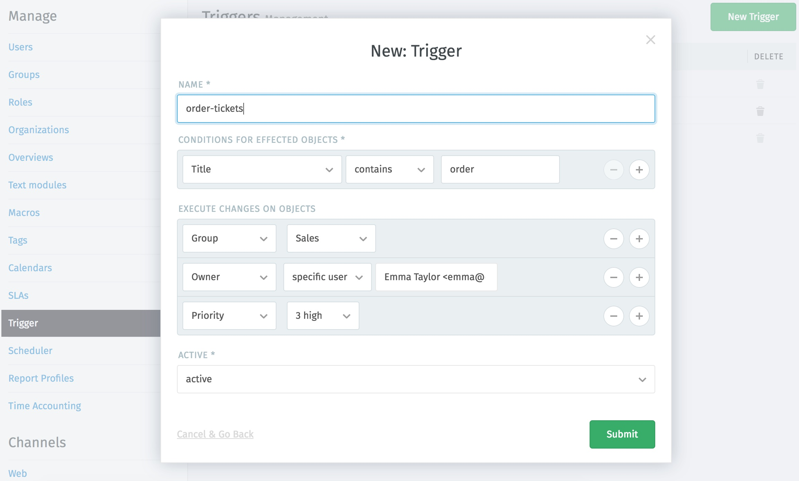
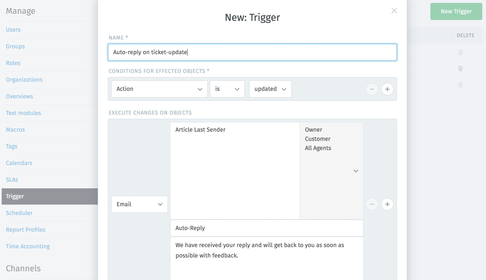

Trigger
*******

Triggers perform action-based changes to the ticket. Triggers will be executed (ordered by name) on every ticket creation or update. Auto-replys on tickets are also implemented via this function.

That's how it works:
-------------

**1. Determine the ticket attributes (conditions)**

...to limit the tickets on which an action is to be performed (these can also be arbitrarily combined and thus specified):

.. image:: images/manage/Zammad_Helpdesk_-_Triggers10.jpg

Ticket attributes:
  Define matching ticket attributes for which a trigger will be executed. You can also distinguish between creating and updating tickets (it’s called action).

Article attributes:
  If you define article attributes, the changed ticket must have a new article and the new article must match the selected attributes.

Customer attributes:
  The customer attributes of the changed ticket must match these selected attributes.

Organization attributes:
  The organization attributes of the changed ticket must match these selected attributes.

**2. Determine the change to be made on the ticket**

Based on matching conditions, certain changes on tickets will be made and/or notifications will be sent:

.. image:: images/manage/Zammad_Helpdesk_-_Triggers11.jpg

The following can be changes on objects:
- either an automatic change of ticket information (status, owner, title,...) or
- an automatically generated email that is sent to the customer or the agent of the relevant ticket or to all agents in the system.

Here a few examples:
-------------

1.) With this trigger you automatically categorize a ticket, which comes from a specific customer to a specific group.
All of Jacob Smith's tickets arrive in Zammad and are automatically assigned to the Sales group:

2.) With this trigger you automatically categorize a ticket that contains "order" in the subject line is assigned to a the group "Sales", to the agent who processes all orders and gives a high priority:

3.) With this trigger, the person who created the last article in the ticket receives an automatic email.

