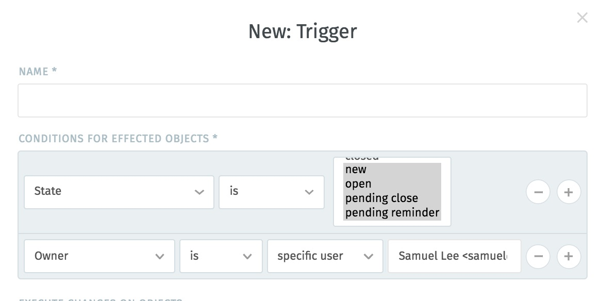
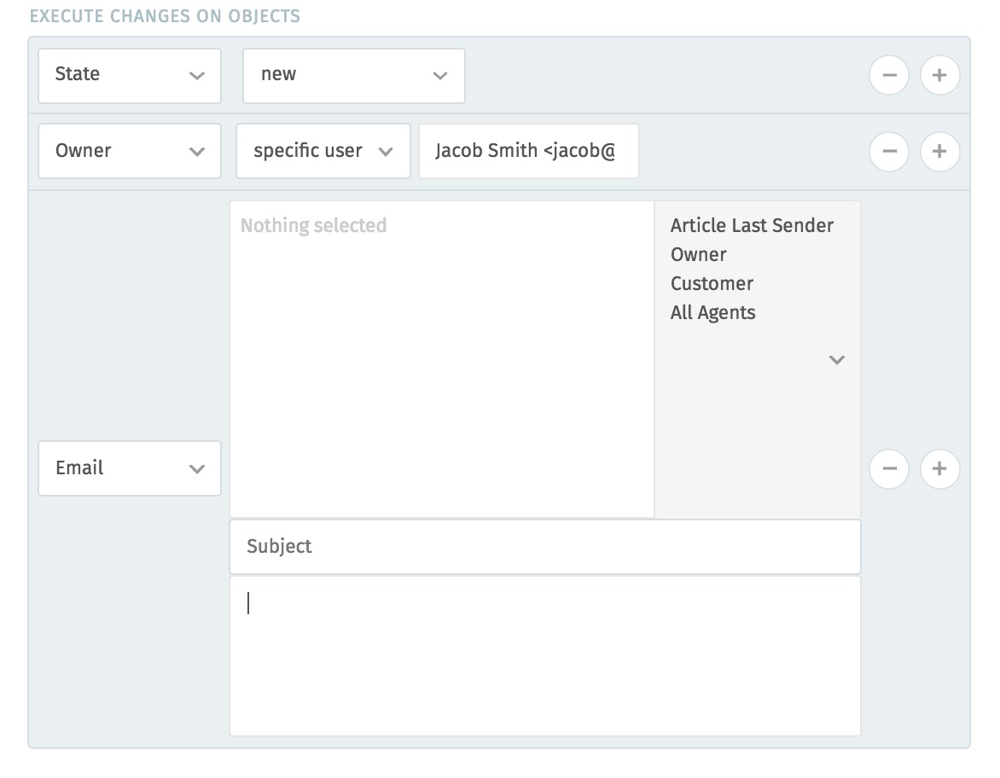

Trigger
=======

Every time a customer creates a new ticket, they automatically receive a
confirmation email to assure them that their issue has been submitted
successfully. This behavior is built into Zammad, but it’s also highly
customizable, and you can set up other automated actions just like it.

Maybe you want to set a higher priority on any ticket with the word “urgent” in
the title. Maybe you want to *avoid* sending auto-reply emails to customers
from certain organizations. Maybe you want mark a ticket as “pending” whenever
someone adds an internal note to a ticket.

Whatever it is, you can do it with **triggers:** actions that watch tickets for
certain changes, and then fire off whenever those changes occur.

How Do They Work?
-----------------

Triggers consist of two parts: **conditions** and **changes**. Conditions
answer the question, “when should this trigger fire?” Changes answer the
question, “what should happen when it does?”

Triggers are evaluated in alphabetical order, by **name.**

Conditions
~~~~~~~~~~

When creating a trigger, define your conditions here:

If you set multiple conditions for a trigger, they must **all** be true for it
to fire. You can configure triggers to fire based on the properties of:

The **Ticket** itself
  *e.g.,* Was this ticket newly created? Is the ticket currently open? When was
  the last time we received contact from the customer on this ticket?

New **Articles** on the ticket
  *e.g.,* Was this article added by email? by phone? Was it created by an
  agent, or a customer? Does the subject contain a certain set of words?

The **Customer** that created the ticket
  *e.g.,* What is the customer’s name? Is the customer a VIP? What department
  does the customer work in?

The **Organizations** that the ticket’s customer belongs to
  *e.g.,* What is the name of the customer’s organization? Does it have a note
  attached to it containing a certain set of words?

Changes
~~~~~~~

When creating a trigger, define your changes here:

A trigger can do two things once its conditions have been met:

Modify the ticket
  *e.g.,* Escalate its priority, close it, reassign it, rename it, add tags,
  etc.

Send an email
  Either to the customer, the agent who owns the ticket, or every agent in the
  system.

Examples
--------

1. Any time Jacob Smith creates a ticket, assign it to the Sales group:

   .. image:: images/manage/Zammad_Helpdesk_-_Triggers.jpg

2. Emma Taylor is responsible for all sales internally, so if a new ticket has
   the word “order” in the subject, assign it to her and make sure it’s set
   with a high priority:

   .. image:: images/manage/Zammad_Helpdesk_-_Triggers2.jpg

3. Send an auto-reply email to *anyone* who responds to a ticket:

   .. image:: images/manage/Zammad_Helpdesk_-_Triggers3.jpg

Other Notifications
-------------------

There are other notification emails sent by Zammad that are not configurable as
triggers (*e.g.,* the notifications that **agents** receive when a new ticket
is created, or when a ticket is escalated). These notifications are built into
Zammad itself, and if you need to customize them, you will have to modify some
of the files on your server.

Inside your Zammad directory (usually ``/opt/zammad``), email templates for
various events are stored inside the ``/app/views/mailer`` directory, named
according to the language they’re written in. Thus, ::

  /opt/zammad/app/views/mailer/ticket_create/de.html.erb

is the German-language template used to notify agents whenever a new ticket is
created. To modify this template, create another file with the same name and
add a ``.custom`` suffix: ::

  /opt/zammad/app/views/mailer/ticket_create/de.html.erb.custom

Now, this file will be used instead of the original when sending notification
emails in German.
