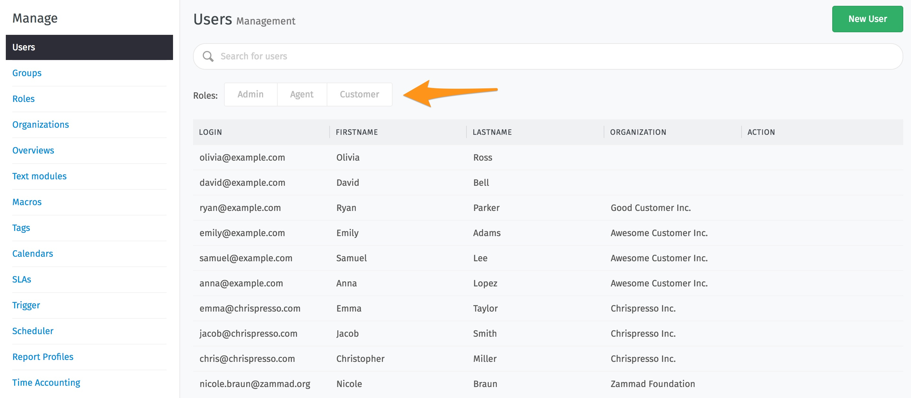
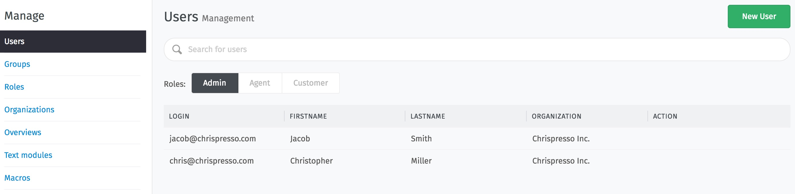
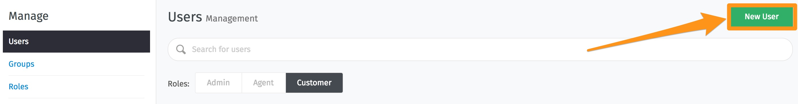
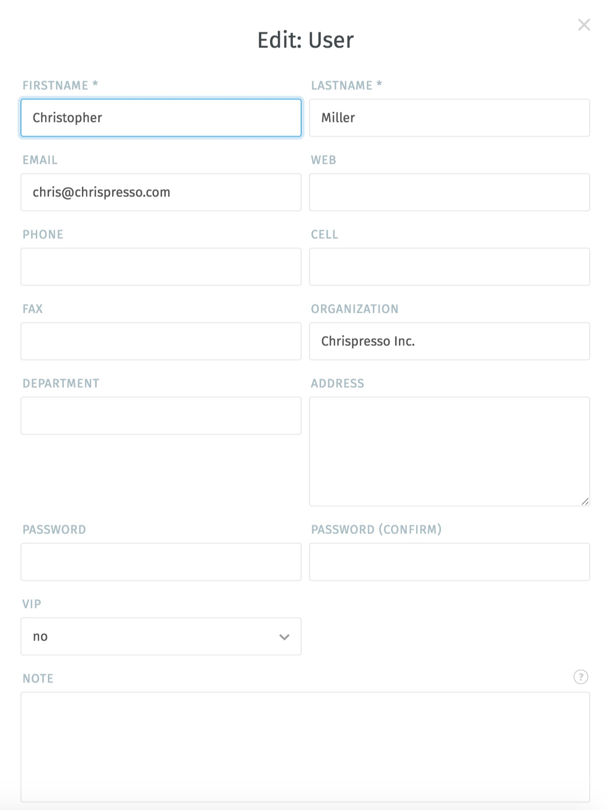
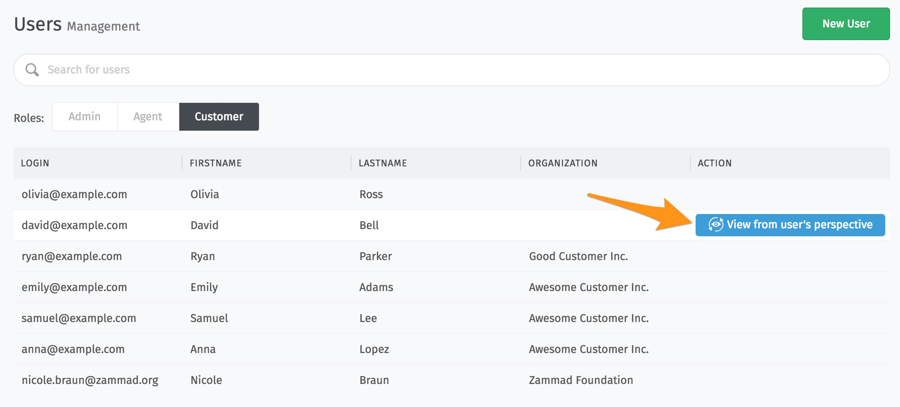
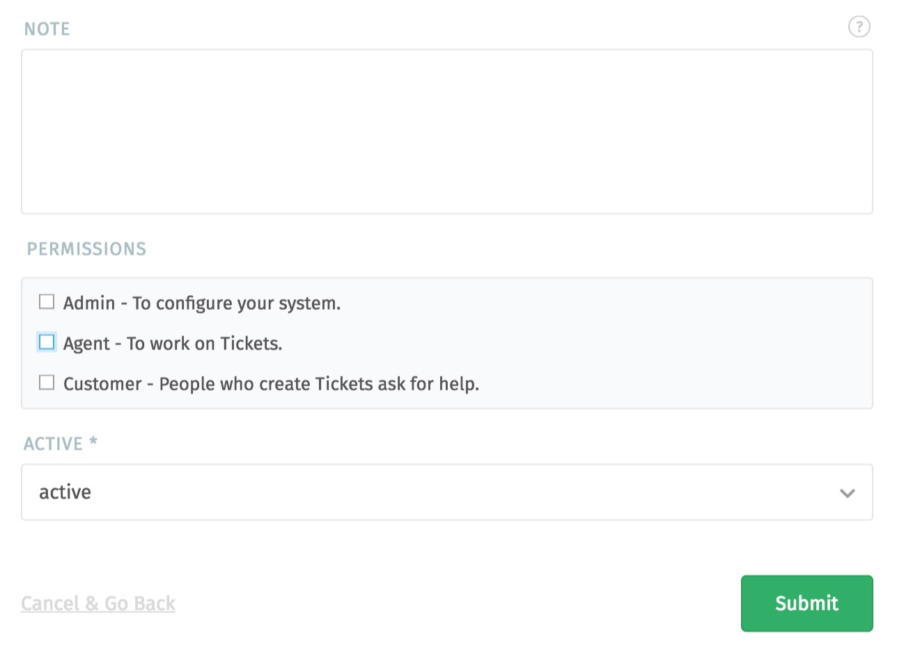
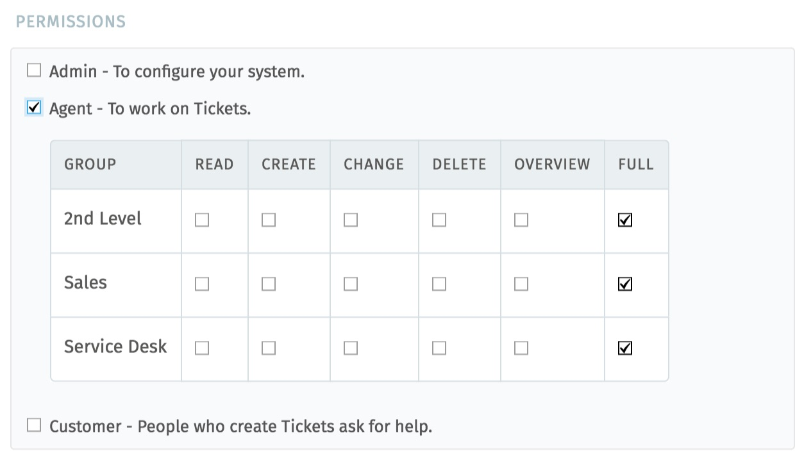

Users
*****

This is the user-management-area. all users who have access to Zammad can be edited here.
There is an overview about all registered users in the system. That includes agents, admins and customer:

If nothing has been selected, as you can see on the last screen, all user groups are displayed. If you select one (or two) user groups, only the users that are assigned to this role are displayed, as you can see in the following picture:

On the right a new user can be created:

Existing users can be edited by clicking on an existing user. You can reach the following mask on both paths. In the upper part of the mask all personal details can be registered. 

You can create further fields in the agent interface by choosing System --> Objects.

In the "Organization" field, the user can be directly assigned to a customer group / organization. Only existing organizations can be selected.

You can also change the password to log in to Zammad.

Users can be set as a VIP (These users can be selected specifically for the SLA or other automatisms, in which these users must be distinguished from other users)

It's also possible to show the view from user's perspective - scroll over the action-column, like that:

This function can be used, for example, to test whether the rights assignment for the respective user has been set correctly - i. e. that this user only has access to the areas assigned to him/her.

Information about the user can be entered in the lower part of the edit mask. This information is only visible to agents:
 

---The assignment of rights / Permissions ---
...can only be set here via this mask!

First, you can set which role you have in the system. Does this user have administrative rights, is he an agent who processes the tickets or a customer who only sees and processes his own tickets?

If the current user is an agent, you can select this option to open further settings. Now it is possible to select which rights are assigned to him in which group:

If a user gets no rights to one group, the system does not display a ticket or ticket notification to the user. This group, for which he has no rights, is also not displayed in the group selection.

---side note---
Every user needs their own e-mail address to log in to the system and to view and edit their tickets. Agents and Admin need the email address for registration only. The emails sent to the customer are written from the email-address set in the group settings. Your own e-mail address can be placed in the signature.  
