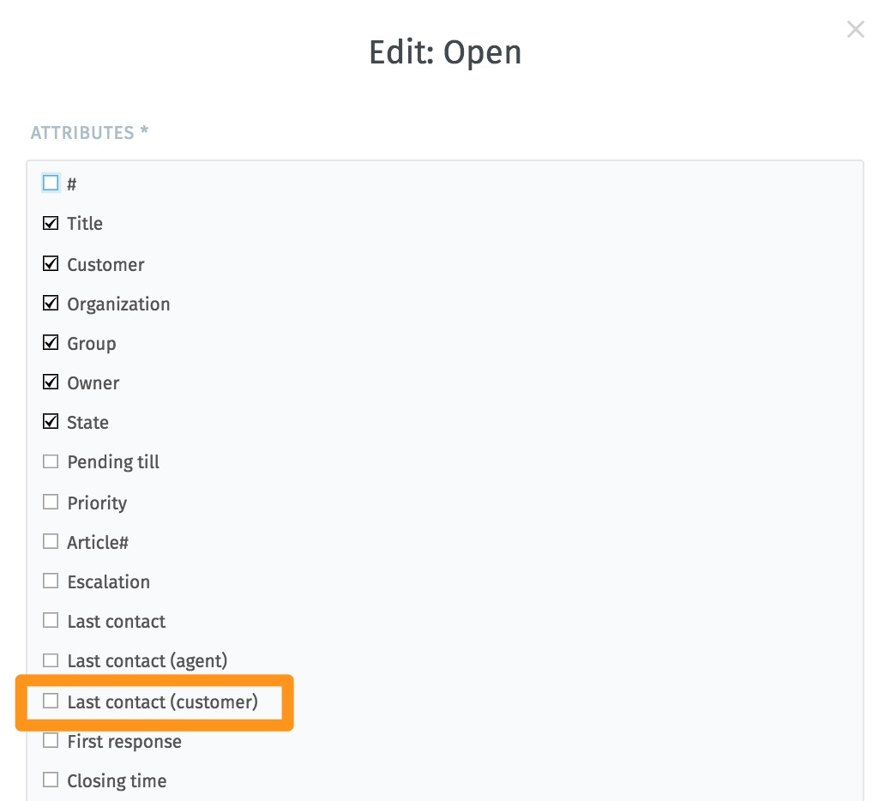
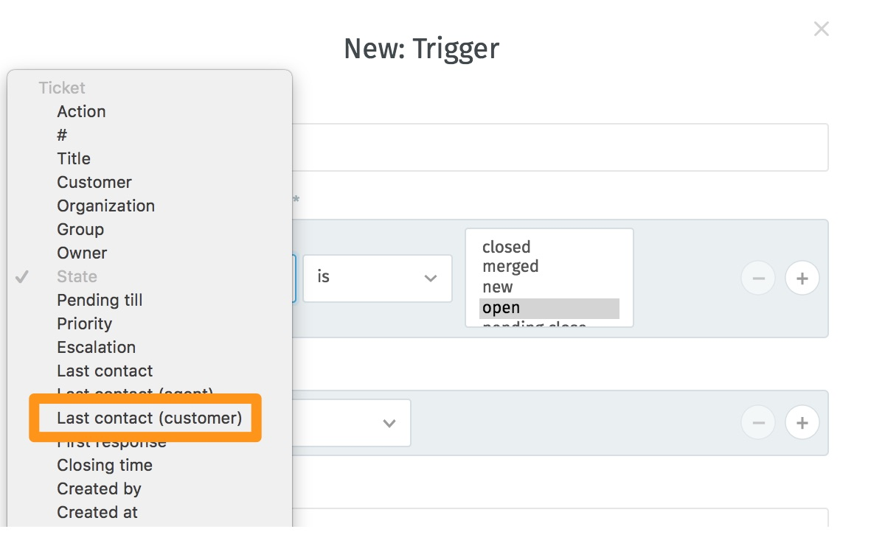

Ticket
******

Base
----------

*Ticket Hook*
	The identifier for a ticket, e. g. Ticket#, Call#, MyTicket#. The default is Ticket#.

*Ticket Hook Position*

The format of the subject.

*Right* means the number is at the right side, name of the ticket on the left: Some Subject [Ticket#12345]

*Left* means the number is at the left side, name of the ticket on the right: [Ticket#12345] Some Subject

*None* means there is no ticket-number, only the name of the ticket: Some Subject (without ticket number). In the last case you should enable "postmaster_follow_up_search_in" to recognize followups based on email headers and/or body.

*Ticket Last Contact Behaviour*
Sets the last customer contact based on the last contact of a customer or on the last contact of a customer to whom an agent has not yet responded.

This specification refers to settings, for example, in the overviews:

or when setting triggers:

So if it is set "without consideration an agent has replied to it" --> Then the time of the last contact of the customer will be shown, although the agent has sent a message to the customer in the meantime.

Number
----------
*Ticket Number Format*
	Selects the ticket number generator module.

	Increment increments the ticket number, the SystemID and the counter are used with "SystemID.Counter" format (e.g. 1010138, 1010139).
	With Date the ticket numbers will be generated by the current date, the SystemID and the counter. The format looks like "Year.Month.Day.SystemID.Counter" (e.g. 201206231010138, 201206231010139).

*OPTIONS*
	With Checksum, a checksum will be appended to the counter. The format looks like "SystemID.Counter.CheckSum" (e. g. 10101384, 10101392).
	--> Checksum:
	--> MIN. SIZE OF NUMBER

Auto Assignment
----------

In a larger Zammad environment, it happens that several agents open the same ticket at the same time. Although collision detection is then effective, the efficiency of processing can be increased by means of the new automatic assignment of tickets when a ticket is opened.

The automatic assignment of tickets can be activated and configured in the admin area under "Settings"->"Ticket"->"Automatic assignment".

The following parameters can be configured:

A filter to select the tickets for which automatic assignment is to be activated (e.g. only for the sales group)
Exceptions of users for which no automatic assignment is to be active (e.g. for group leaders).
