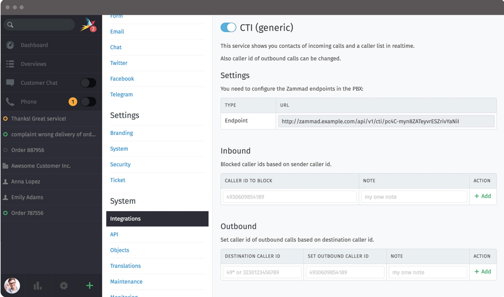

Integrations (Telephony)
***********************

CTI (generic)
=============

Since Zammad 2.6 anyone with access to a CTI (computer telephony integration) system can use the phone-functionality.

Using the CTI-integration enables you to greet customers by name,  get their tickets up on the screen with a single click. Or, identify missed calls at a glance, and return calls right from within Zammad.
Manufacturers of telephone systems or developers can use this interface to connect their telephone system to Zammad.

What do I need to get started?
------------------------------

Zammad requires the following information to support the agent:

- individual call events (e.g., call incoming/answered/ended)
- caller ID data

To use the new CTI interface, your CTI system must transmit this information (and only this information) to Zammad via HTTP.

What can it do for me?
----------------------

***Inbound calls***
- Caller ID display: Open a caller’s customer profile with just one click
- Intelligent caller ID search: Automatically scans tickets for caller ID data (e.g., in email signatures) if customer account data is missing
- Caller overview: See a caller’s entire ticket history, or instantly create a new ticket
- Call journal: See all calls at a glance, along with their status (e.g., which ones require a call-back?)
- Agent overview: See who’s currently on a call
- Selective call blocking [1]_
- Do-not-disturb mode [1]_

***Outbound calls***

- Direct dialing: Initiate calls from within Zammad [1]_
- Dynamic caller ID: Set your caller ID based on, e.g., the destination country of the call*

.. [1] requires PBX/telephone system support

.. image:: images/system/CTI-1.jpg

More information can be found on https://docs.zammad.org/en/latest/cti-api-intro.html

placetel CTI
============

Starting with Zammad 2.8, we're also supporting the CTI for placetel. For configuration, please go to the Admin-Settings -> Settings -> Integrations => Placetel.

Limitations
-----------

Please note, that it's not possible to log outbound calls.
This is due to a limitation of the placetel-API.

Getting needed information from placetel
----------------------------------------

Before starting with Zammad, you'll need to login to your placetel Account, go to Administration -> Settings.
Here you'll find the tab "External APIs" (open it). Activate "activate Call Control-/Notify-API" and enter the URL of the Zammad-API-Endpoint (can be found within the placetel-Integration page).
Further below you can tick the phone numbers you want Zammad to get notified on.

.. image :: images/system/placetel-1.jpg

Now change to the API-tab and grab your API-Token. If you don't have an API-Token yet, you can simply create one.

.. image :: images/system/placetel-2.jpg

Activating placetel-Integration within Zammad
---------------------------------------------

Enabling the Zammad placetel integration is really easy. Simply paste your API-Token into the text field, activate the integration and save your changes.
You're all set up! If needed, you can add Inbound caller IDs to a ignore list. If you do this, Zammad will not show any notifications from those numbers.

Further below on the same page you'll have a log of recent notifications that came to the API, in case you need to debug something.

.. image :: images/system/placetel-3.jpg

As soon as you start calling (in and out) on activated numbers, you'll see them in your Caller log with their current state.

.. image :: images/system/placetel-4.jpg