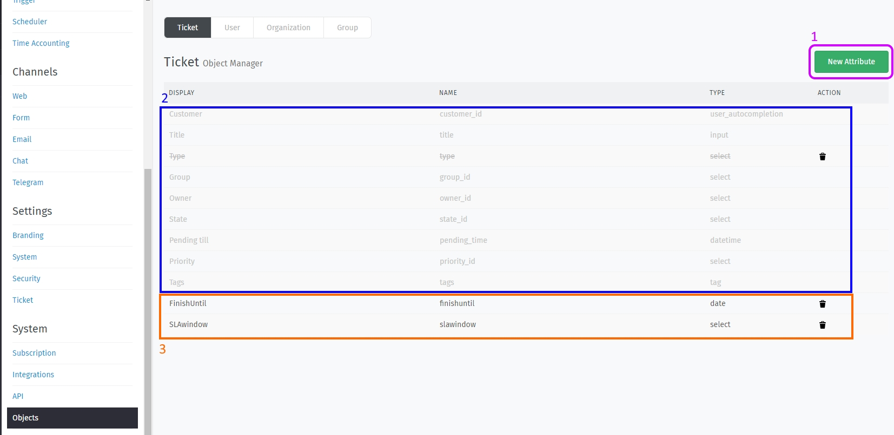
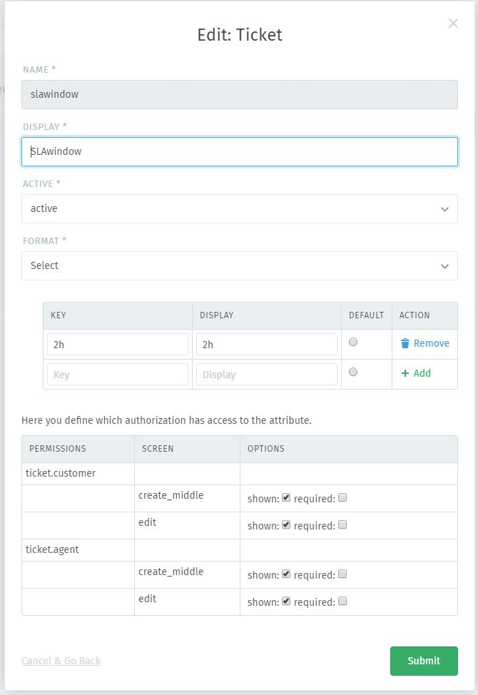

Objects
*******

In Zammad you can add your own fields to Tickets, Users, Organizations or even Groups. 
This can be useful if you need to add further information to a ticket that you do not want to have in a note (you'll find it easier).

**Please note:** Try to avoid deleting objects (rather disable them) as Zammad might run into unexpected conditions.

Here's a overview of the objects. On the upper right you can add new Attributes (no 1).
By default, there will be no custom fields - standard objects (no 2) will be grayed out, you can't delete or change those. 
Custom objects (no 3) will be displayed in black font and have a trash bin on the right site to delete not needed objects.
By click on custom objects, you can edit them so they can suite your needs.

When adding a new object, you can choose between the following object types:

- Boolean
   - true or false, you can adjust the display for those keys and mark a default one
- Date
   - enables you to use the date picker of Zammad
   - You can Allow / Forbid the date chosen to be in the future and in past
   - set the default time difference in hours
- Date-time
   - enables you to use the date picker plus time selection of Zammad
   - You can Allow / Forbid the date chosen to be in the future and in past
   - set the default time difference in hours
- Integer
   - you can et the default value of this field 
   - you can configure the minimum and maximum value that can be used
- Select
   - you can add as many selections you need, you'll see the field as drop-down menu
   - they key and display name can differ (display name can be translated if needed) 
   - You can select a default value for this field, if you want to 
- Text
   - you can enter a default value 
   - you can choose between the following types: E-Mail, Phone, Text or URL
   - you can pick the maximum length of the field
- Tree Select
   - this object enables you to use up to 6 sub keys
   - you'll see this object as a kind of drop down menu 
   
**Note:** You cannot change the object format / type as soon as you applied it.
If you do not further need an object, you can disable it.

Further more you can define permissions for customers and agents. The following options apply to both groups

- During Ticket creation
   - show / hide the field 
   - make the field required (if needed)
- During Updating a ticket
   - show / hide the field 
   - make the field required (if needed)
   
Please note that the above does not apply to default objects being shipped with Zammad.

